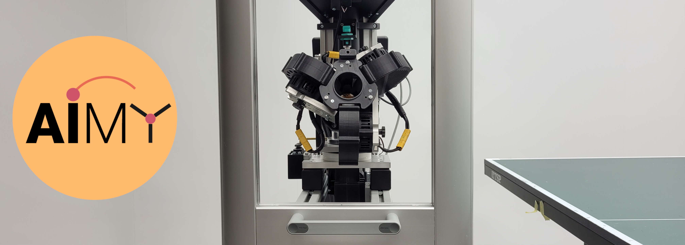

<p align="center">
  
</p>

# AIMY Evaluation and Target Shooting


[](https://github.com/ambv/black)
[](https://arxiv.org/abs/2210.06048) 

This repository provides the evaluation code of the publication 

> "AIMY: An Open-source Table Tennis Ball Launcher for Versatile and High-fidelity Trajectory Generation"

accepted to ICRA 2023.

It contains scripts for recording, preprocessing and visualisation of evaluation data. Furthermore, we provide the suite for target shooting with a feed-forward neural network.

# AIMY

AIMY is a custom-designed three-wheeled table tennis ball launcher designed for advancing table tennis robot research.

# Dependencies

Basic dependencies:
``` 
pip install numpy, pandas, scipy, matplotlib, seaborn, pytest, h5py, tensorflow
```

Misc dependencies:
``` 
pip install isort, black, flake8, mypy, tickzplotlib, sphinx
```

Interfacing MPI Intelligent Soft Robots Lab libraries:

- **ball_launcher beepy**: low-level control software of the table tennis ball launcher
- **tennicam_client**: ball position tracking system
- **signal_handler**: tracks interrupts via terminal

The low-level control software for AIMY can be found [here](https://github.com/intelligent-soft-robots/ball_launcher_beepy).

# Citing AIMY

To cite **AIMY** in your academic research, please use the following bibtex lines:
```bibtex
@inproceedings{dittrich2023aimy,
  title={AIMY: An open-source table tennis ball launcher for versatile and high-fidelity trajectory generation},
  author={Dittrich, Alexander and Schneider, Jan and Guist, Simon and G{\"u}rtler, Nico and Ott, Heiko and Steinbrenner, Thomas and Sch{\"o}lkopf, Bernhard and B{\"u}chler, Dieter},
  booktitle={2023 IEEE International Conference on Robotics and Automation (ICRA)},
  pages={3058--3064},
  year={2023},
  organization={IEEE}
}

```

# License

[BSD 3-Clause](https://github.com/intelligent-soft-robots/aimy_target_shooting/blob/main/LICENSE) license.

Copyright © 2023, Max Planck Gesellschaft
